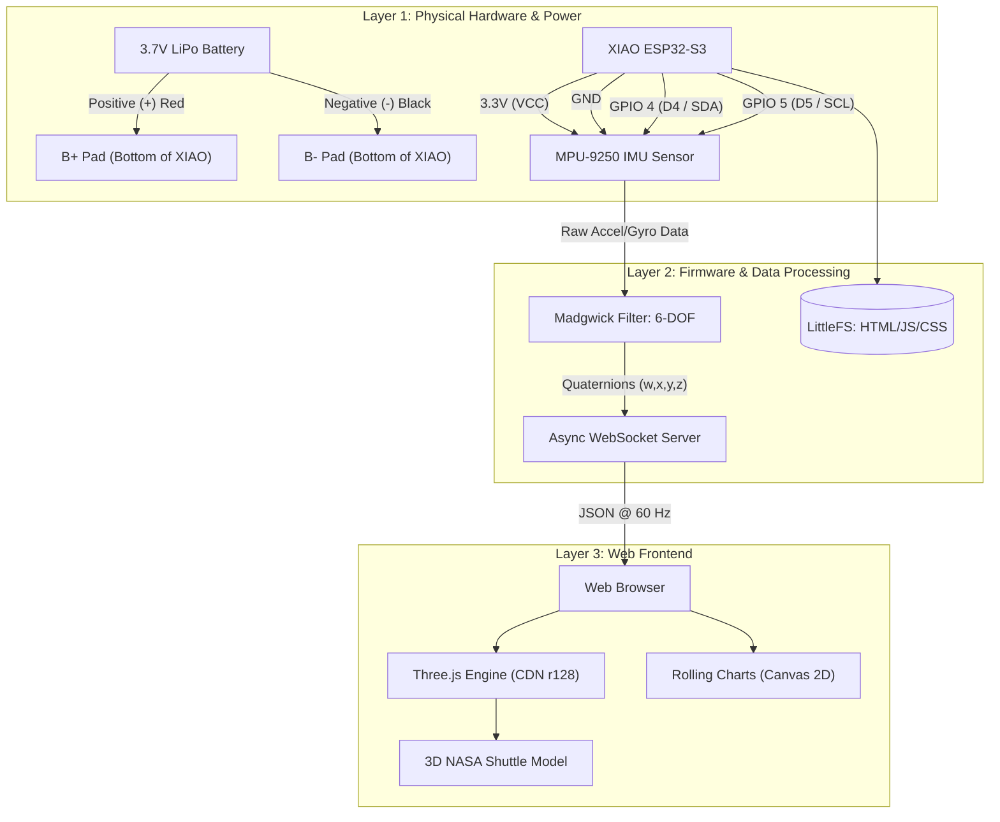

# XIAO-S3 NASA Shuttle Orientation Dashboard

A high-performance IIoT visualization project utilizing the **Seeed Studio XIAO ESP32-S3** and the **MPU-9250** (9-DOF) sensor. This system provides real-time 3D orientation tracking (NASA Shuttle) in a web browser via WebSockets and Three.js.

## Overview

- **Real-time Sensor Fusion:** Implements a custom Madgwick filter to convert raw IMU data into stable quaternions.
- **Low-Latency Communication:** Uses asynchronous WebSockets to stream orientation data at 60 Hz.
- **Dual-Core Architecture:** Core 1 runs sensor reading + fusion at 200 Hz; Core 0 handles WiFi AP + WebSocket broadcast.
- **Decoupled Frontend:** A Three.js-based dashboard hosted on LittleFS and served directly from the ESP32.
- **Autonomous Power:** Integrated LiPo battery management for a completely wireless 3D-printed model.

## Technical Stack

- **Hardware:** Seeed Studio XIAO ESP32-S3 (Dual-core, Wi-Fi/BT, LiPo charging).
- **Sensor:** InvenSense MPU-9250 (I2C @ 400 kHz).
- **Environment:** PlatformIO / VS Code.
- **Firmware:** C++ with `ESPAsyncWebServer` and `Bolder Flight Systems MPU9250`.
- **Frontend:** HTML5, CSS3, JavaScript (Three.js r128), WebSockets.

## Dependencies

| Library | Version | Source | Notes |
|---|---|---|---|
| Bolder Flight Systems MPU9250 | 1.0.2 | [PlatformIO Registry](https://registry.platformio.org/libraries/bolderflight/Bolder%20Flight%20Systems%20MPU9250) | See [Known Incompatibilities](#known-incompatibilities) |
| ESPAsyncWebServer (lacamera fork) | 3.1.0 | [GitHub](https://github.com/lacamera/ESPAsyncWebServer) | ESPHome-maintained fork, includes AsyncTCP-esphome 2.1.4 |
| ArduinoJson | ^7.0.0 (resolves 7.4.x) | [PlatformIO Registry](https://registry.platformio.org/libraries/bblanchon/ArduinoJson) | |

### Known Incompatibilities

**Bolder Flight Systems MPU9250 v5.x (v5.3.0 - v5.6.0) is NOT compatible with Arduino/PlatformIO on ESP32.** The v5.x line was rewritten for Bolder Flight's own build system and introduces the following breaking issues:

1. **Eigen dependency conflict:** The v5.x library depends on `Bolder Flight Systems Eigen` which defines a variable `B1` in `BDCSVD.h`. This collides with Arduino's `binary.h` macro `#define B1 1`, causing compilation errors.
2. **Undeclared transitive dependencies:** The v5.x `mpu9250.cpp` requires `units.h` (another Bolder Flight library) which is not declared in `library.properties`, so PlatformIO cannot resolve it automatically.
3. **Namespace change:** v5.x uses `bfs::Mpu9250` with a completely different API (`Begin()`, `Read()`, `ConfigAccelRange()`) compared to v1.x (`begin()`, `readSensor()`, `setAccelRange()`).

The v1.0.2 API is stable, lightweight (no Eigen), and fully compatible with ESP32 Arduino framework.

**ESPAsyncWebServer (me-no-dev original) is abandoned.** The original `me-no-dev/ESPAsyncWebServer@1.2.4` and `me-no-dev/AsyncTCP@1.1.1` are no longer maintained. We use the [lacamera/ESPAsyncWebServer](https://github.com/lacamera/ESPAsyncWebServer) fork (maintained by the ESPHome team), which bundles `AsyncTCP-esphome` as a dependency automatically.

## Hardware Wiring (I2C)

| XIAO ESP32-S3 | MPU-9250 Pin | Description |
|---|---|---|
| **3.3V** | VCC | Power Supply |
| **GND** | GND | Common Ground |
| **D4 (GPIO 4)** | SDA | I2C Serial Data |
| **D5 (GPIO 5)** | SCL | I2C Serial Clock |
| **B+ (Pad)** | LiPo Red (+) | Battery Positive |
| **B- (Pad)** | LiPo Black (-) | Battery Negative |

## Project Constants

| Constant | Value |
|---|---|
| Board | `seeed_xiao_esp32s3` |
| SDA / SCL | GPIO 4 / GPIO 5 |
| I2C Frequency | 400 kHz |
| MPU-9250 Address | 0x68 |
| WiFi Mode | AP — SSID `NASA-Shuttle-IMU`, pass `12345678` |
| AP IP | 192.168.4.1 |
| WebSocket Endpoint | `ws://192.168.4.1/ws` |
| Sensor Loop | 200 Hz (Core 1) |
| WS Push Rate | 60 Hz (Core 0) |
| Madgwick Beta | 0.1 |
| Filesystem | LittleFS |

## Project Structure

```
platformio.ini          # Board config, LittleFS, dependencies
src/main.cpp            # WiFi AP, dual-core tasks, WebSocket server
src/sensor_fusion.h     # Custom Madgwick filter (header-only, 6-DOF)
data/index.html         # Dashboard HTML shell
data/app.js             # Three.js scene, WS client, rolling charts
data/style.css          # Dark theme styling
```

## System Architecture



## Build & Upload

```bash
# Add PlatformIO to PATH (add to ~/.zshrc for permanence)
export PATH="$HOME/.platformio/penv/bin:$PATH"

# Build firmware
pio run

# Upload firmware + filesystem
pio run -t upload && pio run -t uploadfs

# Monitor serial output
pio device monitor
```

## Usage

1. Power up the ESP32-S3 with the MPU-9250 connected
2. Connect to WiFi network `NASA-Shuttle-IMU` (password: `12345678`)
3. Open `http://192.168.4.1` in a browser
4. The 3D shuttle model rotates in real-time matching the physical sensor orientation

## Performance Budget

| Resource | Usage |
|---|---|
| RAM | 13.5% (44 KB / 320 KB) |
| Flash | 24.5% (818 KB / 3.3 MB) |
| LittleFS | < 20 KB (index.html + app.js + style.css) |
| WebSocket bandwidth | ~7.2 KB/s (120 bytes x 60 Hz) |
| Core 1 CPU | ~5% (sensor + Madgwick @ 200 Hz) |
| Core 0 CPU | ~15-20% (WiFi + JSON + WS) |
